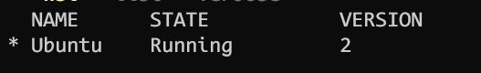
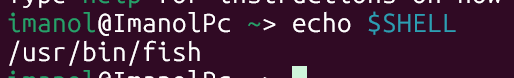

# Pasos para descarga WSL

1. Primero como se desinstala 
Primeramente listamos las distros que tenemos en nuestra maquina (Estamos usando poweshell)
```
wsl --list --verbose
```

Salida esperada:



Luego de esto procedemos a borrarlo 

```
 wsl --unregister Ubuntu
```


2. Ahora lo descargamos 
```
wsl --install -d Ubuntu
```

3. Una vez descargado WSL procedemos a colocar nuestro usernme , asi como nuestro password 
4. Luego de eso procedemos a descargar nuestra shell de fish 

Primero actualizamos todo 
```
sudo apt update
```
Luego descargamos fish

```
sudo apt install fish
```
 
 luego de descargar fish la activamos como nuestra shell por defecto 

 ```
 chsh -s $(which fish)
 ```

 cerramos la terminal y la volvemos a abrir

 --> Como deberia aparecer

 

5. Descargamos Homebrew (brew)

```
/bin/bash -c "$(curl -fsSL https://raw.githubusercontent.com/Homebrew/install/HEAD/install.sh)"
```

 y luego lo agregamos al path para que pueda funcionar, esto lo realizamos entrando a su configuración base que se encuentra en `~/.config/fish/conf.fish` agregamos la linea 
 ```
    echo 'eval "$(/home/linuxbrew/.linuxbrew/bin/brew shellenv)"' >> ~/.config/fish/config.fish
 ```

Suele cambiar bastante con la shell que uses, en este caso estamos usando fish.

 El archivo completo quedaria asi :
 ```
 if status is-interactive
    # Commands to run in interactive sessions can go here
eval (/home/linuxbrew/.linuxbrew/bin/brew shellenv)

end
 ```

 6. Instalamos npm con brew

 ```
 brew install node
 ```

 Asimismo tambie descargamos pnpm 

 ```
 brew install pnpm
 ```

Luego seguimos con neovim

```
brew install neovim
```

Descargamos las herramientas de C
```
sudo apt install build-essential -y
```

Seguimos con git , curl y unzip
- curls.Es una herramienta de línea de comandos para transferir datos hacia o desde un servidor, usando protocolos como HTTP, HTTPS, FTP, entre otros.
- unzip.Es una herramienta para descomprimir archivos .zip. Muchos instaladores (como el de Deno que usaste) descargan un paquete comprimido en formato zip y necesitan unzip para extraer los archivos reales del binario
```
sudo apt install git curl unzip
```
Descargar xclip
Linux no tiene un solo portapapeles del sistema "de fábrica" accesible fácilmente desde la terminal, a diferencia de Windows o macOS.es por eso que neovim  necesita un programa intermediario para "hablar" con ese portapapeles del sistema operativo.
```
sudo apt install xclip
```
Además debemos descargar yarn 

```
npm install -g yarn
```


6. Configuraciones de Neovim
Solamente basta con mover nuestra carpeta de nvim a la carpeta de configuración de nuestro home que es `~/.config` 
 
```
nvim
```

Después de ejecutar neovim es necesario recargar las dependencias de npm debido a que siempre tienen bugs , es cuestión de seguirestos pasos:

Nos dirigimos a la carpeta
```
cd ~/.local/share/nvim/lazy/markdown-preview.nvim/app
```
Luego borramos las dependencias

```
rm -rf node_modules package-lock.json
```

y por ultimo las descargamos 
```
npm install
```
Una vez acabado eso nos dará un error de versión y lo solucionamos yendo a la siguiente carpeta 
```
cd ~/.local/share/nvim/lazy/markdown-preview.nvim
```
Después regresamos a la version donde no causaba conflicto

```
git checkout app/yarn.lock
```
7. Estrcutura básica para entender la estrcutura de los modulos en lua

```lua
return {
  "windwp/nvim-autopairs",  -- [1] el plugin (repositorio de GitHub)
  event = "InsertEnter",     -- [2] cuándo se carga
  opts = {},                 -- [3] opciones de configuración
  config = function(_, opts) -- [4] función que se ejecuta al cargar
    ...
  end,
}
```

8. Conectarse con Github con el protocolo de seguridad ssh

 Lo primero es coloca nuestro nombre y correo globalmente , con esta sintaxis

```
git config --global user.name "Tu Nombre"
git config --global user.email "tu_correo@ejemplo.com"
```

y creamos nuestra clave ssh 
```
ssh-keygen -t ed25519 -f ~/.ssh/ClaveImanol
```

*importante: no colocar agente*

Después agregamos nuestra clave a nuestro .gitconfig con este comando:

```
git config --global core.sshCommand "ssh -i ~/.ssh/ClaveImanol"
```

y desde ese momento nos pedirá contraseña cada vez que hagamos pull , push , etc.

(No olvidar que debemos copiar la clave.pub en nuestro github)


